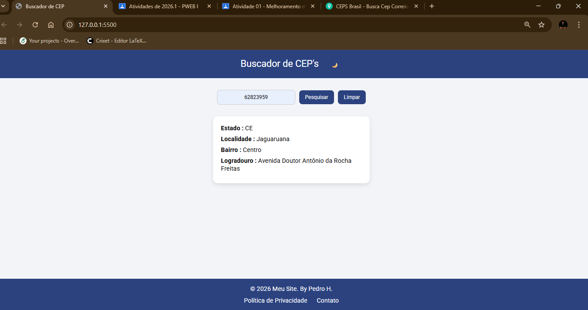
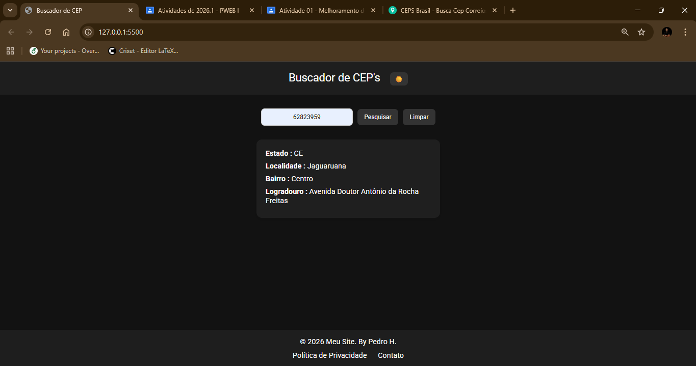
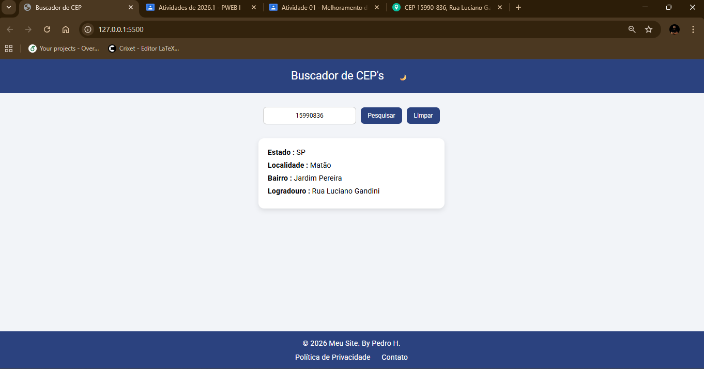

# 🔎 Buscador de CEP | Address Finder

Aplicação web desenvolvida com foco em consumo de API externa, manipulação do DOM e experiência do usuário.

O sistema permite buscar endereços por **CEP** e mostrar **Estado + Cidade + Logradouro**, utilizando a API pública ViaCEP.

---
## 🚀 Demonstração
Caso publicado no GitHub Pages:

---
## ✨ Funcionalidades

- 🔹 Busca de endereço por CEP  
- 🔹 Mostrar Estado (UF), Cidade e Logradouro  
- 🔹 Validação de campos obrigatórios  
- 🔹 Tratamento de erro para CEP inválido ou inexistente  
- 🔹 Loading Spinner animado  
- 🔹 Modo Escuro (Dark Mode)  
- 🔹 Interface responsiva  
- 🔹 Alternância dinâmica de tema  

---
## 🖥 Preview do Projeto

### 🌤 Modo Claro

### 🌙 Modo Escuro

### 🔍 Busca por CEP

---
## 🧠 Conceitos Aplicados

- Manipulação do DOM
- Requisições assíncronas com `async/await`
- Consumo de API REST
- Tratamento de erros com `try/catch`
- Validação de formulários
- Responsividade com Flexbox
- Alternância dinâmica de classes CSS
- Experiência do Usuário (UX)

---
## 🛠 Tecnologias Utilizadas

| Tecnologia | Função |
|------------|--------|
| HTML5 | Estrutura da aplicação |
| CSS3 | Estilização e responsividade |
| JavaScript | Lógica e consumo de API |
| ViaCEP API | Fornecimento de dados de endereço |

---
## 📂 Estrutura do Projeto

📁 buscador-cep
├── index.html
├── style.css
├── script.js
├── prints/
└── README.md

---
## 🌐 API Utilizada

ViaCEP  
https://viacep.com.br/

Exemplo de requisição por CEP:
https://viacep.com.br/ws/62823959/json/

Exemplo de busca por endereço:
https://viacep.com.br/ws/CE/Jaguaruana/Avenida/json/

---

## 📱 Responsividade

A aplicação se adapta automaticamente a:

- 💻 Desktop  
- 📱 Smartphones  
- 📲 Tablets  

---

## 🎯 Objetivo do Projeto

Demonstrar habilidades em:

- Desenvolvimento Front-End
- Integração com API externa
- Organização de código
- Estruturação de projeto
- Boas práticas em JavaScript
- Preparação de projeto para portfólio

---
## 👨‍💻 Desenvolvido por

**Pedro H.**  
Estudante de Programação Web  
2026  

---
## 📌 Observação

Projeto desenvolvido para fins acadêmicos e portfólio profissional.
